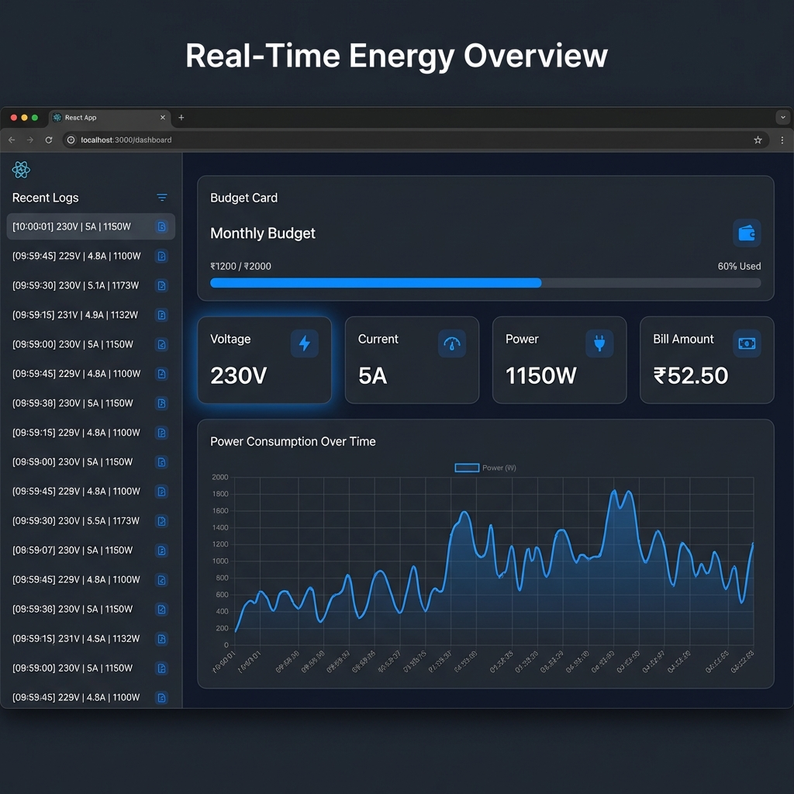

# Smart Energy Meter & Solar Digital Twin

A real-time IoT energy monitoring system comprising an ESP-based hardware meter, a Node.js/Express backend with WebSockets, and a modern React frontend with Digital Twin capabilities.



---

## Table of Contents
- [About the Project](#about-the-project)
- [Key Features](#key-features)
- [The Digital Twin Concept](#the-digital-twin-concept)
- [Prediction Algorithms](#prediction-algorithms)
- [Technology Stack](#technology-stack)
- [Folder Structure](#folder-structure)
- [Getting Started](#getting-started)
- [Hardware Setup](#hardware-setup)
- [API Reference](#api-reference)

---

## About the Project

The **Smart Energy Meter** is designed to provide homeowners with real-time visibility into their electricity consumption. Unlike traditional meters, this system processes data instantly to calculate costs based on dynamic slabs (Indian Electricity Duty standards), predicts monthly bills, and monitors voltage/power surges.

---

## Key Features

- **Real-Time Dashboard**: Live monitoring of Voltage (V), Current (A), Power (W), and Energy (kWh).
- **Dynamic Cost Calculation**:
  - Implements tiered pricing slabs (e.g., 0-100 units, 101-200 units).
  - Includes fixed charges and electricity duty.
- **Solar Digital Twin**:
  - Fetches real-time cloud cover and sunrise/sunset times via OpenWeatherMap.
  - Simulates solar power generation and calculates virtual savings.
- **Alert System**:
  - **Over-voltage/Under-voltage** detection.
  - **High Power Usage** warnings.
  - **Vampire Power Detection**: Alerts power usage during late night hours (11 PM - 6 AM) when household usage should be minimal.
- **Simulation Mode**: Run the entire stack without hardware using the built-in ESP simulator.

---

## The Digital Twin Concept

A **Digital Twin** is a virtual representation of a physical object or system. In this project, we create a Digital Twin of a **Solar Power System**.

Even if you don't have solar panels installed, the application simulates how much energy a standard 3kW solar setup *would* generate at your specific location in real-time.

**How it works:**
1.  **Weather Data**: The backend fetches live weather data (Sunrise, Sunset, Cloud Cover) from OpenWeatherMap API for your configured city.
2.  **Solar Simulation model**: We calculate a "Sun Factor" based on the time of day relative to sunrise/sunset.
3.  **Virtual Production**: The system computes theoretical power generation:
    ```
    Solar Output = Max Capacity (3000W) × Sun Factor × (1 - Cloud Cover %)
    ```
4.  **Virtual Savings**: It then calculates how much money you *would* have saved on your current electricity bill if you had solar panels.

---

## Prediction Algorithms

### 1. Monthly Bill Prediction
The application predicts your final monthly bill based on your current usage trend.
- **Logic**: `(Current Bill / Days Passed) × Total Days in Month`
- This helps users verify if they are on track to stay within their budget.

### 2. Tiered Billing Calculation
We use a standard Indian electricity tariff structure for precise cost estimation:
- **0 - 100 units**: ₹3.00 / unit
- **101 - 200 units**: ₹5.00 / unit
- **> 200 units**: ₹7.00 / unit
- **Fixed Charge**: ₹50.00
- **Electricity Duty**: 5% tax on the total amount.

---

## Technology Stack

- **Frontend**: React.js, Vite, Chart.js, CSS3.
- **Backend**: Node.js, Express.js, Socket.io.
- **Hardware Firmware**: C++ (Arduino Framework) for ESP8266/ESP32.

---

## Folder Structure

```
/
├── backend/            # Node.js Server & Simulator
│   ├── server.js       # Main entry point (Express + Socket.io)
│   └── mock_esp.js     # Simulation script for testing without hardware
├── firmware/           # Microcontroller Code
│   └── esp_code.ino    # Arduino sketch for ESP8266/ESP32
├── src/                # React Frontend Source
│   ├── components/     # Reusable UI components
│   ├── pages/          # Main views (Dashboard, Analytics, Digital Twin)
├── public/             # Static Assets
└── legacy/             # Archived files (ignored by git)
```

---

## Getting Started

### Prerequisites
- **Node.js**: v16 or higher.
- **Arduino IDE**: For flashing the physical code (optional).

### Installation

1.  **Clone the Repository**
    ```bash
    git clone https://github.com/Bhavanish5041/Energy-meter.git
    cd Energy-meter
    ```

2.  **Install Dependencies**
    ```bash
    npm install
    ```

### Running the Application

**Option 1: Development Mode**
```bash
# Terminal 1: Frontend
npm run dev

# Terminal 2: Backend
npm start
```
Access the app at `http://localhost:5173`.

**Option 2: Simulation Mode**
```bash
# Keep the backend running (npm start)
# Open a new terminal:
npm run simulate
```

---

## Hardware Setup

1.  **Components**: ESP8266 or ESP32, PZEM-004T (Power Monitor Module).
2.  **Wiring**:
    - PZEM VCC -> 5V
    - PZEM GND -> GND
    - PZEM RX -> ESP TX (D2/GPIO)
    - PZEM TX -> ESP RX (D1/GPIO)
3.  **Flash Firmware**:
    - Open `firmware/esp_code.ino` in Arduino IDE.
    - Install `PZEM004Tv30` library.
    - Update the `ssid`, `password`, and `host` variables.
    - Upload to board.

---

## API Reference

### 1. Submit Energy Data
**Endpoint**: `POST /api/data`

Used by the ESP device to send real-time readings.

**Headers**:
- `Content-Type: application/json`

**Request Body**:
```json
{
  "voltage": 230.5,   // Volts (float)
  "current": 5.2,     // Amps (float)
  "power": 1200,      // Watts (float)
  "energy": 15.4      // kWh (float)
}
```

**Response**:
- `200 OK`: Data processed successfully.
- `400 Bad Request`: Missing voltage or current fields.

### 2. WebSocket Events
The backend emits real-time events via Socket.io.

- **Listen to `energy-update`**: Receives the full state object (voltage, power, bill, solar, etc.).
- **Listen to `new-alert`**: Receives alert objects (type, message, timestamp).